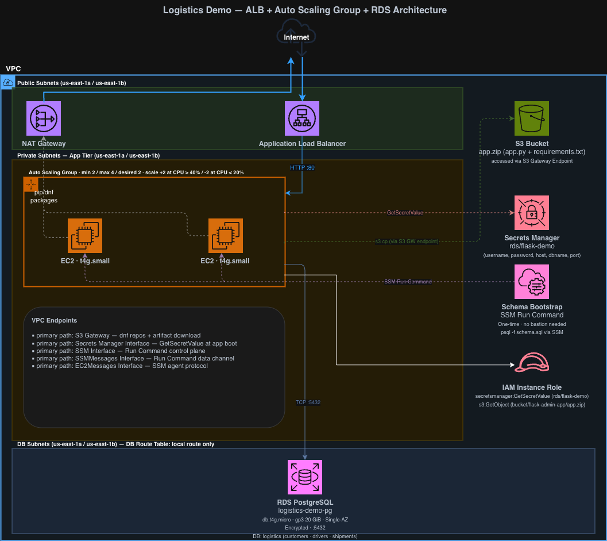

# Logistics — Auto Scaling Group + RDS PostgreSQL



> Move beyond serverless: run a Flask web application on EC2, scale it automatically, and connect to a managed relational database — all without ever SSH-ing into a server.

## What you'll deploy

- **ALB** (Application Load Balancer) — distributes HTTP traffic across EC2 instances
- **EC2 Auto Scaling Group** — 1–3 instances in private subnets; scales on CPU
- **RDS PostgreSQL** — Multi-AZ-capable instance in isolated DB subnets
- **Secrets Manager** — stores and rotates the RDS password; instances fetch it at startup via IAM
- **Systems Manager** — S3 Gateway + SSM endpoints so private instances need no NAT for patch/schema work
- **S3** — artifact bucket for `app.zip` (no manual file transfer to instances)
- **IAM** — instance profile with least-privilege access to S3, Secrets Manager, SSM, and CloudWatch

## What you'll learn

- EC2 Launch Template and Auto Scaling Group lifecycle
- ALB target groups and health checks
- RDS subnet groups and security group isolation (app SG → RDS SG, no public access)
- Secrets Manager: storing credentials and having instances fetch them without hardcoding
- SSM Run Command for zero-bastion database schema bootstrap
- CloudWatch alarms for scale-out and scale-in

## Quick start

1. **Prerequisites:** AWS account (us-east-1), VPC with public + private + DB subnets. Deploy `vpc-cidr-getaz-outputs-db-subnets.yaml` from [aws-cfn-snippets](https://github.com/BoldFellow/aws-cfn-snippets) as stack named `VPCs` first.
2. **Deploy this stack** — follow [guide.md](guide.md) for the full console walkthrough, or use the CFN shortcut:
   ```bash
   aws cloudformation deploy \
     --template-file cfn/template.yaml \
     --stack-name logistics \
     --capabilities CAPABILITY_IAM \
     --parameter-overrides VpcStackName=VPCs
   ```
3. **Bootstrap the schema** — use the SSM Run Command script in `scripts/` after instances register with the target group

## What you'll destroy at cleanup

```bash
aws cloudformation delete-stack --stack-name logistics
```

**Manual cleanup required:**
- Delete the NAT Gateway and release the Elastic IP (CFN does not manage these if created manually per the guide)
- Empty and delete the S3 artifact bucket

**Estimated cost while running:** ~$3–$5/day (RDS `db.t3.micro` ~$1.50/day + NAT Gateway ~$1.10/day + EC2 `t3.micro` ~$0.25/day)

**After cleanup:** zero ongoing cost (terminate RDS promptly — it charges by the hour even when idle)

## Files

| File | Purpose |
|---|---|
| `architecture.png` / `architecture.drawio` | System diagram |
| `cfn/template.yaml` | CloudFormation template — full stack |
| `guide.md` | Full console walkthrough |
| `app/app.py` | Flask application — shipment tracking with 5 statuses |
| `app/schema.sql` | PostgreSQL schema — shipments table |
| `app/requirements.txt` | Python dependencies |
| `app/app.zip` | Application deployment package (upload to S3 artifact bucket) |
| `scripts/ssm-run-schema-from-artifact.sh` | SSM Run Command script — runs schema.sql on an EC2 instance |

## License

MIT — see [LICENSE](LICENSE).
